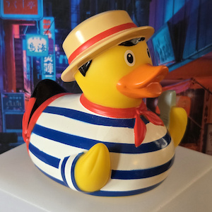

# Ducks

There are some ducks here. But not enough. Never enough.

Bring me more ducks.

The flock must grow.

| The Duck | About the Duck |
|----------|----------------|
|  | A classic duck with "Rockstars IT" branding, picked up during a tech event. |
|  | This brave duck is openly French, god bless him. |
|  | A female duck equipped with swimming gear. |
|  | A gondolier duck from Venice, pride of the Italian navy. |
|  | Two ducks on their wedding day. Fun fact: ducks do not mate for life and are only seasonally monogamous. |
|  | A hardcore gamer duck. The stuff he says on Xbox Live cannot be reprinted here. |
|  | _"There is no bread allowed in the club. At the bottom of this elevator, there is a coat-check girl, and if we're lucky, one duck for checking bread."_  _"And if we're unlucky?"_  _"There will be many ducks."_  &mdash; scene from The Matrix Revolutions (duck edition) |
